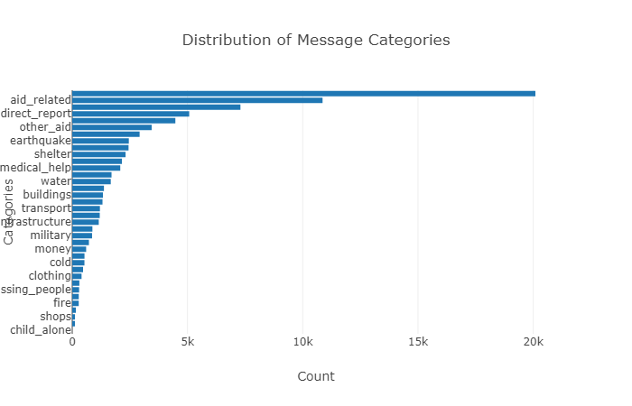
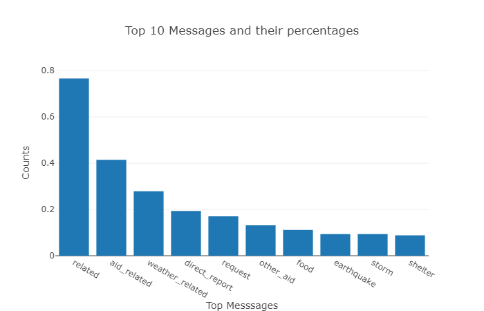

# Disaster Response Pipeline Project

### Background:

This is a text classification project for real messages that were sent during disaster events. We have used disaster data from Figure Eight to build a model for an API that classifies these disaster messages into 36 different categories. We created a ETL pipeline and a machine learning pipeline to categorize these events so that the messages can be sent to an appropriate disaster relief agency.

This project includes a web app where an emergency worker can input a new message and get classification results in several categories.

### Instructions:

1. Run the following commands in the project's root directory to set up your database and model.

    - To run ETL pipeline that cleans data and stores in database
        `python data/process_data.py data/disaster_messages.csv data/disaster_categories.csv data/DisasterResponse.db`
    - To run ML pipeline that trains classifier and saves
        `python models/train_classifier.py data/DisasterResponse.db models/classifier.pkl`

2. Run the following command in the app's directory to run your web app.
    `python run.py`

3. Go to http://0.0.0.0:3001/

  

  

  

  

